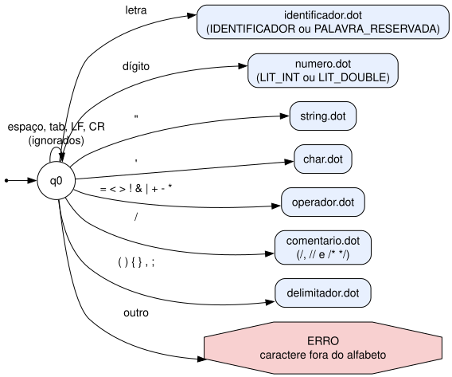
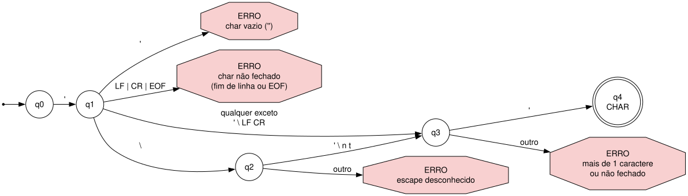
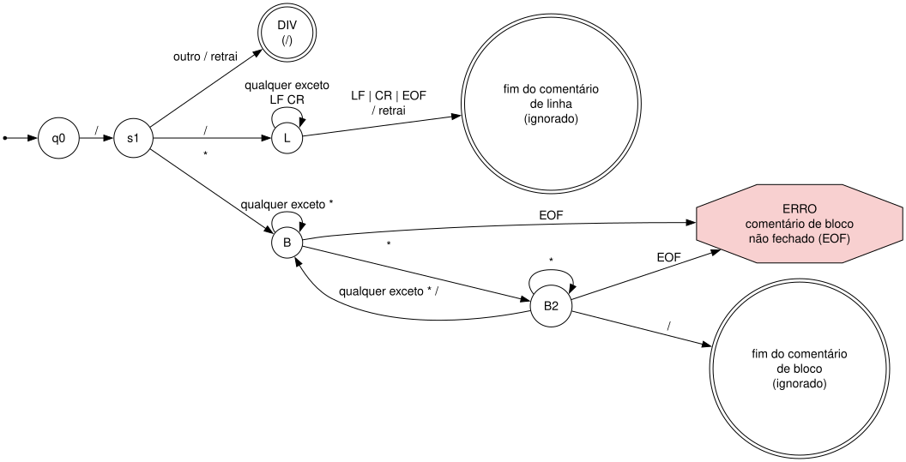
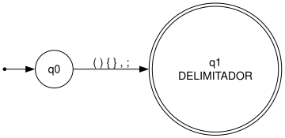
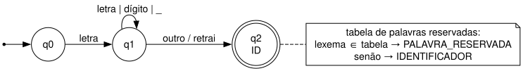
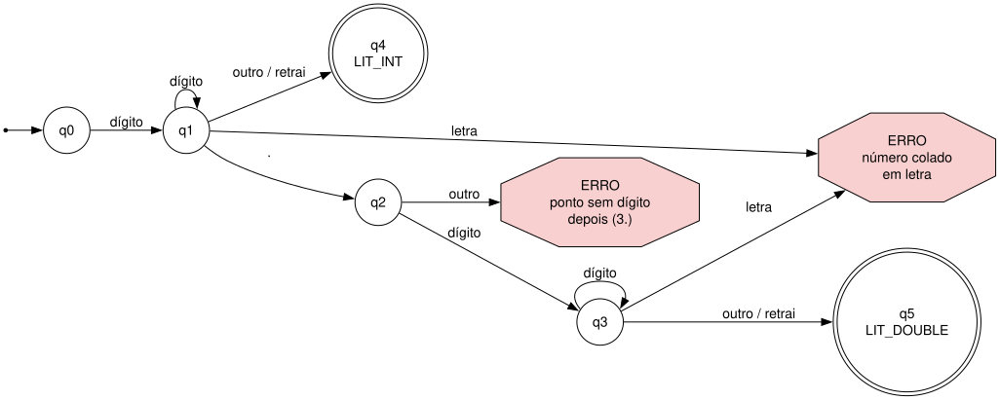
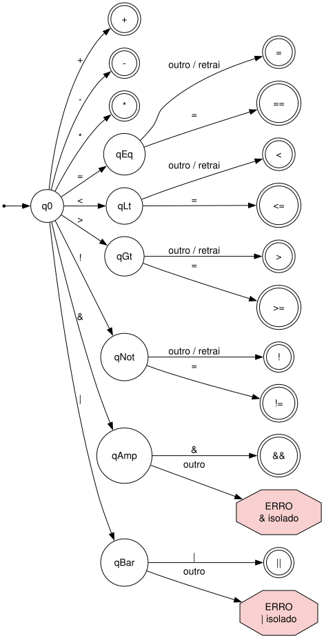
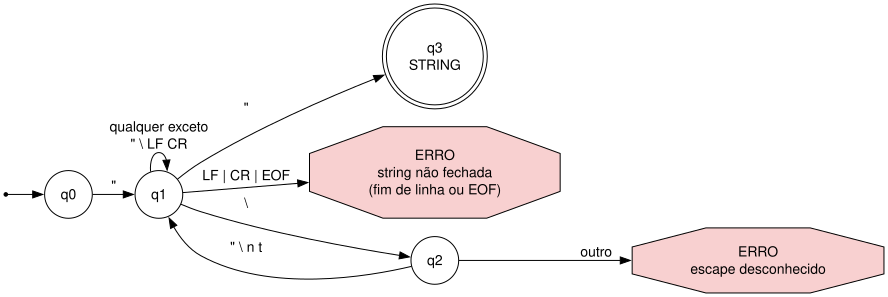

# Especificação Léxica 

Construção de Compiladores · Checkpoint 1

## 1. Tabela de tokens

Convenções: `letra ::= [a-zA-Z]`, `digito ::= [0-9]`. Aspas em `"..."` na coluna de notação indicam caractere literal.

| Categoria | Notação (RegEx / EBNF) | Exemplos | Decisões de projeto |
| :--- | :--- | :--- | :--- |
| **Identificador** | `letra ( letra \| digito \| "_" )*` | `total`, `x1`, `contaItens`, `taxa_juros`, `Total` (≠ `total`) | Case-sensitive. `_` permitido após a letra inicial, nunca como primeiro caractere. Sem limite de tamanho. Sem acentos. |
| **Palavra reservada** | Mesmo padrão do identificador, mas presente na tabela fixa da Seção 6. | `if`, `while`, `int`, `True` | Lista fechada de 12 palavras. |
| **String** | `"\"" ( [^"\\\n\r] \| "\\\"" \| "\\\\" \| "\\n" \| "\\t" ) * "\""` | `"ok"`, `"Ele disse \"oi\""`, `"linha 1\nlinha 2"` | Apenas aspas duplas. Escapes: `\"`, `\\`, `\n`, `\t`. **Não** pode conter quebra de linha real. Erro léxico se não fechar até o fim da linha ou EOF. Escape desconhecido (ex.: `\q`) é erro léxico. |
| **Char** | `"'" ( [^'\\\n\r] \| "\\'" \| "\\\\" \| "\\n" \| "\\t" ) "'"` | `'a'`, `'Z'`, `'5'`, `'\n'`, `'\''` | Aspas simples, exatamente 1 caractere (ou 1 sequência de escape). Escapes: `\'`, `\\`, `\n`, `\t`. `''` (vazio) e mais de 1 caractere são erros léxicos. |
| **Operador** | `=` \| `==` \| `<` \| `<=` \| `>` \| `>=` \| `!=` \| `!` \| `+` \| `-` \| `*` \| `/` \| `&&` \| `\|\|` | `=`, `==`, `<=`, `!`, `!=`, `&&` | 14 operadores (Seção 7). *Maximal munch*. `&` e `\|` isolados são erro léxico. |
| **Delimitador** | `(` \| `)` \| `{` \| `}` \| `,` \| `;` | `(`, `)`, `{`, `}`, `,`, `;` | Lista fechada de 6 símbolos. Sempre token de 1 caractere. |
| **Literal numérico** | `digito+ ( "." digito+ )?` | `10`, `3.14`, `0`, `007` | Apenas base decimal, sem sinal (o `-` é sempre o operador; o sinal unário é tratado pelo parser). Zeros à esquerda são aceitos de propósito (`007` vale 7). Sem notação científica nem hexadecimal. |

Casos de borda de números:

| Entrada | Resultado |
| :--- | :--- |
| `3.` | Erro léxico (ponto sem dígito depois). |
| `.5` | Erro léxico (`.` não inicia nenhum token). |
| `1.2.3` | Token `1.2`, depois erro léxico no segundo `.`. |
| `12abc` | Erro léxico (número colado em letra). Exige separador. |

---

## 2. Alfabeto de entrada (Σ)

Fora de strings, chars e comentários, só estes caracteres são válidos:

* **Letras:** `a-z`, `A-Z` (sem acentuação)
* **Dígitos:** `0-9`
* **Underscore:** `_`
* **Ponto:** `.` (somente dentro de literal numérico)
* **Aspas:** `"` (string) e `'` (char)
* **Barra invertida:** `\` (somente dentro de string e char)
* **Operadores:** `=`, `<`, `>`, `!`, `+`, `-`, `*`, `/`, `&`, `|`
* **Delimitadores:** `(`, `)`, `{`, `}`, `,`, `;`
* **Espaço em branco:** espaço, tab, `\n`, `\r`

**Dentro de strings, chars e comentários**, qualquer caractere é aceito (inclusive acentuados, em UTF-8), exceto as restrições de cada token (quebra de linha em string/char, aspas de fechamento e barra invertida sem escape válido).

**Fora do alfabeto** (ex.: `@`, `#`, `$`, `[`, `]`, `.` isolado): erro léxico, ver Seção 8.

---

## 3. Case-sensitivity

A linguagem é *case-sensitive*, tanto para identificadores (`Total` ≠ `total`) quanto para palavras reservadas (`if` é palavra reservada; `If` é um identificador comum). Palavras reservadas seguem a mesma regra de maiúsculas/minúsculas dos identificadores. A única diferença é a consulta posterior à tabela fixa (Seção 6).

---

## 4. Espaços em branco e comentários

* Espaços, tabs e quebras de linha são ignorados entre tokens (não geram token) e servem de separadores.
* **Comentário de linha:** `//` até o fim da linha (a quebra de linha não faz parte do comentário).
* **Comentário de bloco:** `/* ... */`. **Não aninhado**: o primeiro `*/` encontrado fecha o comentário, mesmo que haja um `/*` no meio.
* Comentário de bloco não fechado até o EOF é erro léxico.
* Um `*/` fora de comentário não é token especial: é lido como `*` seguido de `/`.

---

## 5. Regra de desambiguação (*maximal munch*)

O *scanner* sempre tenta consumir o maior prefixo válido antes de decidir o token.

| 1º caractere | Próximo caractere | Token |
| :--- | :--- | :--- |
| `=` | `=` | `==` |
| `=` | outro | `=` |
| `<` | `=` | `<=` |
| `<` | outro | `<` |
| `>` | `=` | `>=` |
| `>` | outro | `>` |
| `!` | `=` | `!=` |
| `!` | outro | `!` (negação lógica, ex.: `!ativo`) |
| `&` | `&` | `&&` |
| `&` | outro | erro léxico |
| `\|` | `\|` | `\|\|` |
| `\|` | outro | erro léxico |
| `/` | `/` | início de comentário de linha (não é operador) |
| `/` | `*` | início de comentário de bloco (não é operador) |
| `/` | outro | `/` (divisão) |

Para `/`, comentário tem prioridade sobre operador: `a //b` é `a` seguido de comentário, e `a / b` é divisão.

Para identificadores e números, o token termina no primeiro caractere que não continua o padrão (por exemplo, `x1+y` gera `x1`, `+`, `y`), com a exceção de número colado em letra descrita na Seção 1.

---

## 6. Lista fechada de palavras reservadas

`int`, `double`, `bool`, `char`, `string`, `void`, `return`, `if`, `else`, `while`, `True`, `False`

12 palavras, cobrindo tipos básicos, controle de fluxo, funções com/sem retorno e literais booleanos.

---

## 7. Lista fechada de operadores

`=`, `==`, `<`, `<=`, `>`, `>=`, `!=`, `!`, `+`, `-`, `*`, `/`, `&&`, `||`

14 operadores.

---

## 8. Erros léxicos

O *scanner* reporta cada erro com **linha e coluna** e uma mensagem, e continua a análise a partir do próximo caractere seguro para poder listar vários erros de uma vez. São erros léxicos:

* caractere fora do alfabeto (`@`, `#`, `$`, `[`, `]`, `.` isolado);
* `&` ou `|` isolados;
* string não fechada até o fim da linha ou EOF; escape desconhecido em string ou char;
* char vazio (`''`), char com mais de um caractere ou char não fechado;
* comentário de bloco não fechado até o EOF;
* número malformado (`3.`, `12abc`).

### 00_scanner

### char

### comentario

### delimitador

### identificador

### numero

### operador

### string

